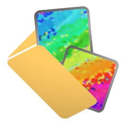

<!--suppress ALL -->

    
	<h1 style="padding-bottom: .3em !important; border-bottom: 1.5px solid #d0d7deb3 !important;">KalloPic</h1>

    Folder-based picture viewer,
    filter and 
    archiver

    
    
        
    
    

    English | <a href="README_zh-CN.md">中文</a>

