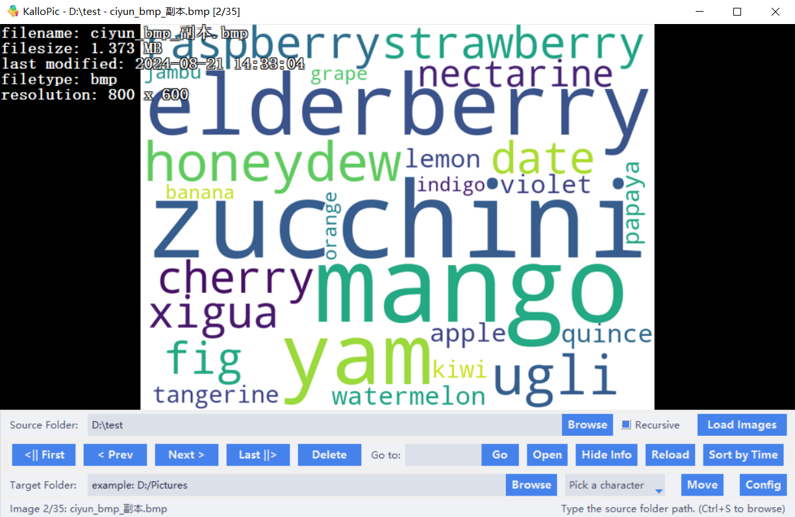
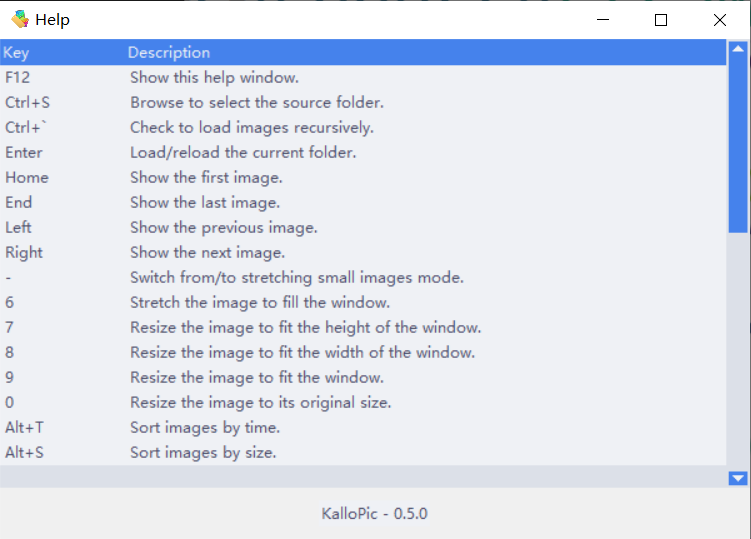
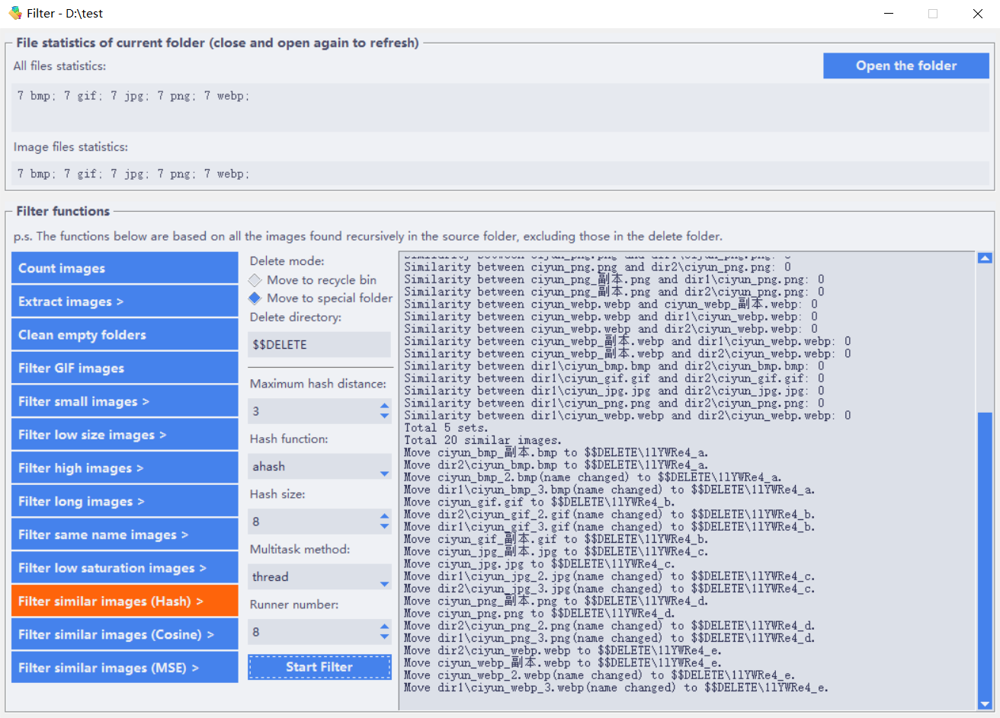
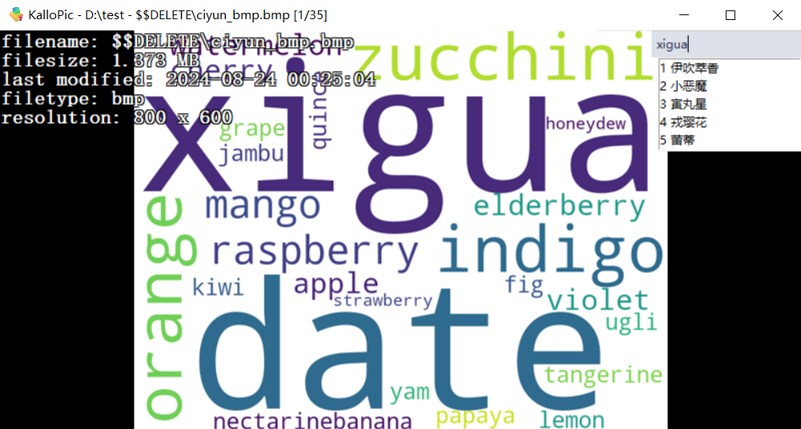
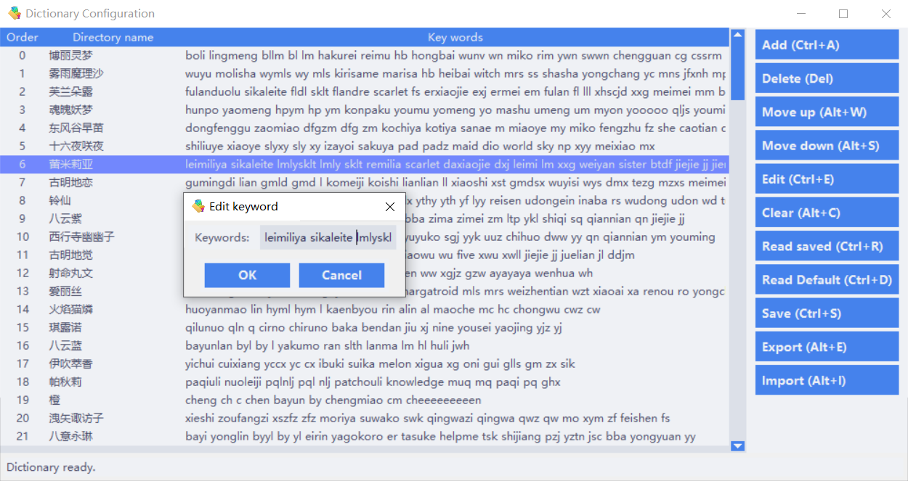

<!--suppress ALL -->

    
	<h1 style="padding-bottom: .3em !important; border-bottom: 1.5px solid #d0d7deb3 !important;">KalloPic</h1>

    Folder-based picture viewer,
    filter and 
    archiver

    
    
        
    
    

    English | <a href="README_zh-CN.md">中文</a>

## Feature Introduction

KalloPic is a folder-based image viewer, filter, and archiver. It has been packaged as a single-file executable program that can be used on the Windows 10/11 platform. It helps users achieve the following functionalities:

### 1. Simple Image Browsing

- **Folder-Based**: Specify a **source folder**, and the software will open all images within it.
- **Recursive Viewing**: Recursively view all images in the specified folder, including those in subfolders.
- **Supported Formats**: `jpg`, `png`, `bmp`, `gif` (static preview only), `webp`, etc.
- **Various Operations and Browsing Modes**: Sort by time/name/size, reverse sorting, delete, view basic information, set browsing mode, adjust background color, invert colors, rotate, full screen, right-click menu, etc.
- **Hotkey Support**: Most functions have corresponding hotkeys; press <kbd>F12</kbd> to view all hotkeys.

### 2. Image Filtering

After entering a valid source folder path, press <kbd>F9</kbd> to enter the filtering interface.

(1) **Statistics displayed**:
- Number of files of all types;
- Number of files of supported image file types;
- Number of images in each folder under the specified folder.

(2) Move all images (recursively) to a designated folder.

(3) **Filtering Features**:
- Delete all empty folders;
- Delete GIF files;
- Delete images smaller than a specified file size;
- Delete images with dimensions smaller than a specified width or height;
- Delete images taller than a specified height;
- Delete images with a large aspect ratio;
- Delete images with duplicate filenames;
- Delete images with high similarity (choose from **Hash**, **Cosine Similarity**, **MSE** comparison methods);

### 3. Image Archiving

This feature may not be widely applicable but can be helpful for specific user groups. For example, when you have a large number of unsorted images that need manual classification, and they appear disorganized in File Explorer no matter how you sort them, the thumbnail view is unclear, and many images require closer inspection. In such cases, KalloPic's **Image Archiving** function comes into play.

Press <kbd>Esc</kbd> to enter archiving mode, and an input box will appear in the top-right corner of the image browser. After specifying a **target folder**, you can enter lowercase alphabetical **quick keywords** in the input box. Click on the dropdown list options or press the corresponding 1-5 number keys to move the currently opened image to a subfolder under the specified folder named after the selected option.

A folder name can correspond to multiple quick keywords, and multiple **folder name-keywords** pairs form a **dictionary**. Press <kbd>F10</kbd> to edit this dictionary, supporting operations such as adding, deleting, modifying, moving up/down, saving, loading preset dictionaries/saved dictionaries, importing, exporting, and clearing.

Note that this dictionary has a priority order, which determines the order of options when quick keywords correspond to multiple possibilities, allowing users to place frequently used options at the front.

The software includes a preset dictionary containing most character names from the Touhou Project series, with quick keywords mostly being English names, Chinese pinyin and abbreviations, and Chinese nicknames.

  

## Environment Requirements

**Operating Systems Supported for Using the Software**: Windows 10/11

**Dependencies Required for Running and Packaging**:
- Python Version: 3.6+
- pillow
- Send2Trash
- pyperclip
- pypinyin
- opencv-python
- imagehash
- numpy
- pyinstaller

## Installation and Configuration

1. Use the `init_venv.bat` script in this repository to create a virtual environment.

2. (Optional) Add `upx.exe` to `.\venv\Scripts\` to compress executable files.

3. Run `build.bat` to generate executable files. This script invokes the `KalloPic.spec` file for packaging.

## Disclaimer and Notes

1. This project is licensed under the MIT License - see the [LICENSE](LICENSE) file for details.
2. Please back up your data before performing operations such as deletion, filtering, and archiving to prevent data loss due to misoperation or potential software bugs. The author will not be responsible for any data loss or related issues.
3. This software does not have internet connectivity and will not upload any data to the internet or collect any user information.
4. Suggestions, issue reports, and code contributions are welcome. Your usage and feedback are my motivation for continued maintenance and improvement.