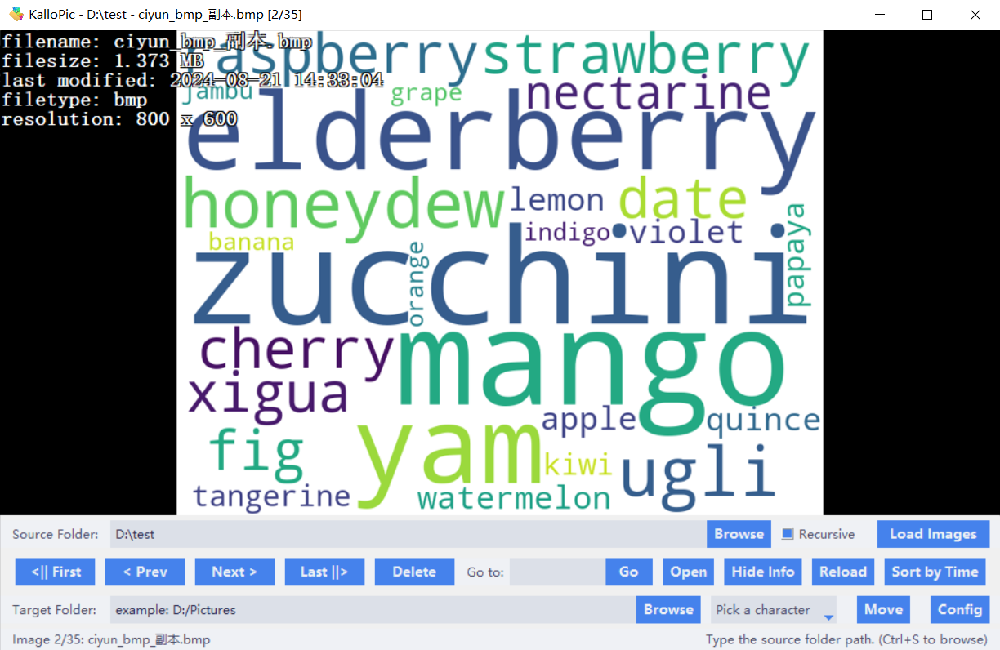
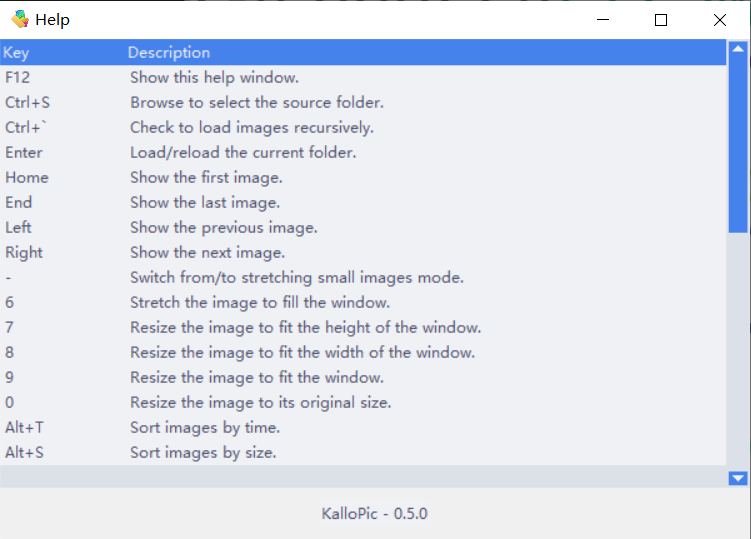
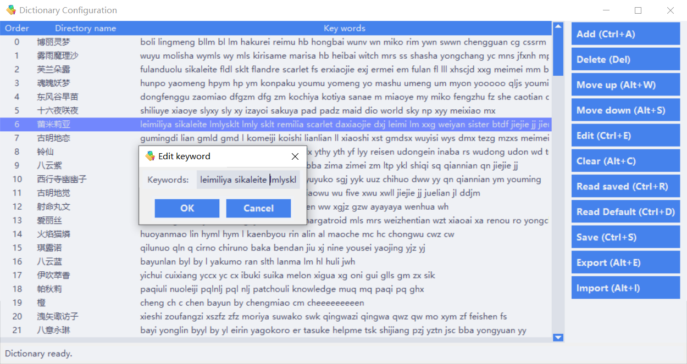

<!--suppress ALL -->

    
	<h1 style="padding-bottom: .3em !important; border-bottom: 1.5px solid #d0d7deb3 !important;">KalloPic</h1>

    基于文件夹的图片查看器、
    过滤器 和
    归档器

    
    
        
    
    

    <a href="README.md">English</a> | 中文

## 功能介绍

KalloPic 是一个基于文件夹的图片查看器、过滤器和归档器，现已打包为可在 Windows 10/11 平台上使用的单文件可执行程序。它可以帮助用户实现如下功能：

### 1. 简单的图片浏览

- **以文件夹为单位**：需指定一个 **源文件夹**，软件才能打开该文件夹下的所有图片。
- **支持递归浏览**：可以递归查看指定文件夹下的所有图片，包括文件夹下的所有文件夹中的图片。
- **可查看基本的图片格式**：`jpg`、`png`、`bmp`、`gif`（仅支持静态预览）、`webp` 等。
- **支持多种操作和浏览模式**：按时间/文件名/大小排序、倒序排序、删除、查看基本信息、设置浏览方式、调整背景颜色、反色、旋转、全屏、右键菜单等。
- **快捷键支持**：绝大多数功能均有相应快捷键，按下 <kbd>F12</kbd> 可查看所有快捷键。

### 2. 图片过滤

在输入了有效的源文件夹路径之后，按下 <kbd>F9</kbd> 键可进入过滤界面。

(1) **可统计**：
- 所有文件类型的文件数量；
- 本软件支持查看的图片类型的文件数量；
- 指定文件夹下每个文件夹中的图片数量。

(2) 支持将文件夹中的所有图片（递归）移动到指定文件夹中。

(3) **支持如下过滤功能**：
- 删除所有空的文件夹；
- 删除GIF文件；
- 删除小于指定文件大小的图片；
- 删除小于指定图片宽高的图片；
- 删除大于指定图片高度的图片；
- 删除图片宽高比例过大的图片；
- 删除文件名重复的图片；
- 删除相似度过高的图片（可选择 **哈希、余弦相似度、MSE** 三种比较方式）；

### 3. 图片归档

该功能的应用场景并不普遍，对于一些有特定需求的用户群体，可能会有一定的帮助。比如当你手上有一大大大堆需要分类的图片，且不幸的是：你必须手动去分类；这些图片在文件资源管理器中无论用什么排序方式都显得杂乱无章；缩略图看的不清楚，很多图片都需要放大细看，那么这时候，KalloPic 的 **图片归档** 功能就派上用场了。

按下 <kbd>Esc</kbd> 键可进入归档模式，图片浏览器右上角会出现输入框，在指定了 **目标文件夹** 后，可以在输入框中输入仅有小写英文字母的 **快捷关键词**，点击下拉列表中的选项或按下相应的1-5数字键，即可将当前打开的图片，移动到指定文件夹下以选项为名的文件夹。

一个文件夹名可以对应多个快捷关键词，多个 **文件夹名-关键词** 键值对形成一个 **字典**，这一字典可以通过按下 <kbd>F10</kbd> 键进行编辑。支持的操作包括：添加、删除、修改、上/下移、保存、读取预设字典/已保存的字典、导入、导出、清空等。

注意这一字典具有优先级顺序，这是为了在归档时，如果输入的快捷关键字对应多个可能的选项。用户可以根据优先级，将常用的选项排在前面。

本软件已预设一套字典，该字典为东方 Project 系列的绝大部分角色名，快捷关键词大多为角色名的英文、中文拼音及缩写、中文外号及缩写等。

  

## 需求环境

**软件运行所需操作系统**：Windows 10/11

**项目运行与打包所需依赖**：
- Python 版本：3.6+
- pillow
- Send2Trash
- pyperclip
- pypinyin
- opencv-python
- imagehash
- numpy
- pyinstaller

## 安装配置

1. 使用此仓库中的 `init_venv.bat` 创建虚拟环境。

2. （可选）将 `upx.exe` 添加到 `.\venv\Scripts\` 以压缩可执行文件。

3. 运行 `build.bat` 生成可执行文件。这个脚本调用了 `KalloPic.spec` 文件进行打包。

## 声明

1. 此项目采用 MIT 许可证 - 详情请参阅 [LICENSE](LICENSE) 文件。
2. 请在执行删除、过滤、归档等操作之前，做好数据备份，以免因为误操作或可能的软件bug导致数据丢失。如出现数据丢失等问题，作者概不负责。
3. 本软件并不具备联网功能，不会上传任何数据到互联网，也不会收集用户的任何信息。
4. 欢迎提出建议、报告问题、贡献代码。您的使用和反馈是我继续维护和改进的动力。